<div align="center">

# ProofPay

### An agent can prove it paid. ProofPay proves what it received.

**Pay-per-evidence on Hedera x402, with a signed receipt binding the payment**<br>
**to the exact request, delivered research, provenance, and software version.**

<p>
  <a href="https://github.com/aitrailblazer/proofpay-hedera-x402/actions/workflows/ci.yml"></a>
  <a href="https://hedera.com/"></a>
  <a href="https://www.x402.org/"></a>
  <a href="test/"></a>
  <a href="https://github.com/aitrailblazer/proofpay-hedera-x402/releases/tag/demo-v5"></a>
</p>

<p>
  <a href="https://github.com/aitrailblazer/proofpay-hedera-x402/releases/download/demo-v5/ProofPay_Hedera_x402_Bounty_Demo_YouTube_Edition.mp4">▶ Watch the demo</a>
  &nbsp;·&nbsp;
  <a href="https://hashscan.io/testnet/transaction/0.0.7162784-1784665192-906989595">✓ Verify the transaction</a>
  &nbsp;·&nbsp;
  <a href="https://proofpay-hedera.kindbeach-299ce8c4.eastus.azurecontainerapps.io/.well-known/proofpay">⚡ Try the live API</a>
  &nbsp;·&nbsp;
  <a href="https://aitrailblazer.github.io/deltasignal-atlas-codex-plugin/">⌁ Explore DeltaSignal</a>
</p>

<br>

<a href="img/Scene01.jpg">
  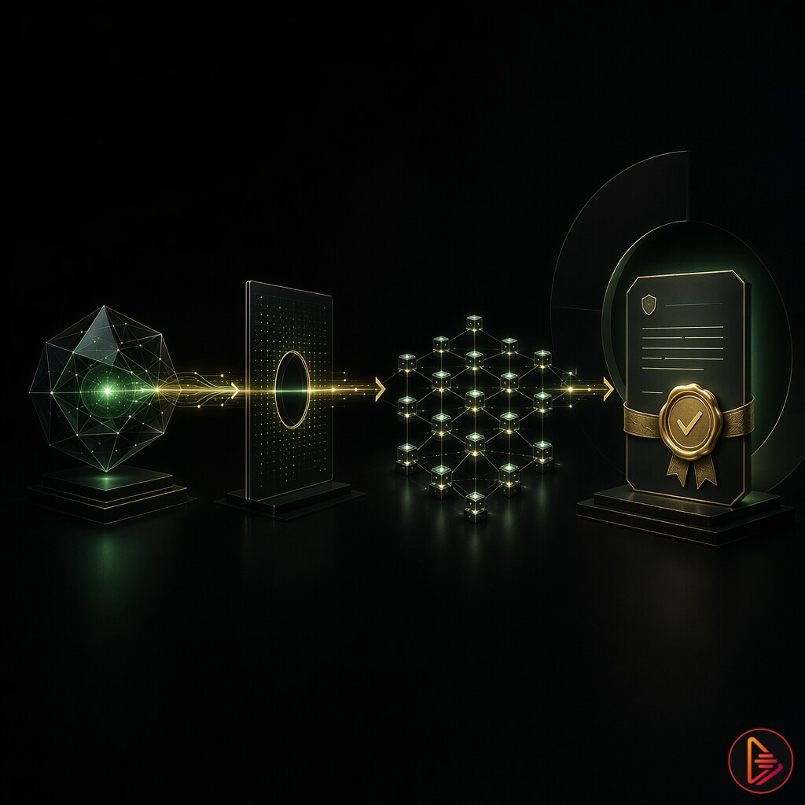
</a>

</div>

---

## The problem, in one look

| A blockchain proves | A blockchain does **not** prove |
|---|---|
| Who paid | What the API returned |
| Who received value | Which request was authorized |
| Amount and consensus time | Which evidence and output were delivered |
| Transaction success | Whether the response was changed later |

**ProofPay closes that gap.** It creates a portable, independently verifiable
receipt joining two worlds:

```text
Hedera settlement
        +
request → evidence → output → provenance → software version
        =
one payment-to-artifact proof
```

This matters for autonomous agents because “the payment succeeded” is not
enough. A buyer, auditor, or downstream agent must also be able to establish
what the payment unlocked.

## What we built

ProofPay demonstrates an autonomous agent purchasing deterministic
[DeltaSignal ATLAS-7](https://aitrailblazer.github.io/deltasignal-atlas-codex-plugin/llms-full.txt)
issuer evidence with HBAR on Hedera testnet.

<table>
  <tr>
    <td><strong>1 · Discover</strong><br>The agent reads the free catalog and requests a single-use quote.</td>
    <td><strong>2 · Pay</strong><br>The protected resource returns HTTP 402 with exact Hedera payment terms.</td>
  </tr>
  <tr>
    <td><strong>3 · Settle</strong><br>The buyer authorizes value; the facilitator verifies and sponsors the network fee.</td>
    <td><strong>4 · Verify</strong><br>ProofPay checks the completed transaction against the Hedera mirror node.</td>
  </tr>
  <tr>
    <td><strong>5 · Unlock</strong><br>The service releases the sealed DeltaSignal evidence only after settlement succeeds.</td>
    <td><strong>6 · Prove</strong><br>An Ed25519 receipt binds payment, request, evidence, output, and provenance.</td>
  </tr>
</table>

<p align="center">
  <a href="img/Scene03.jpg">
    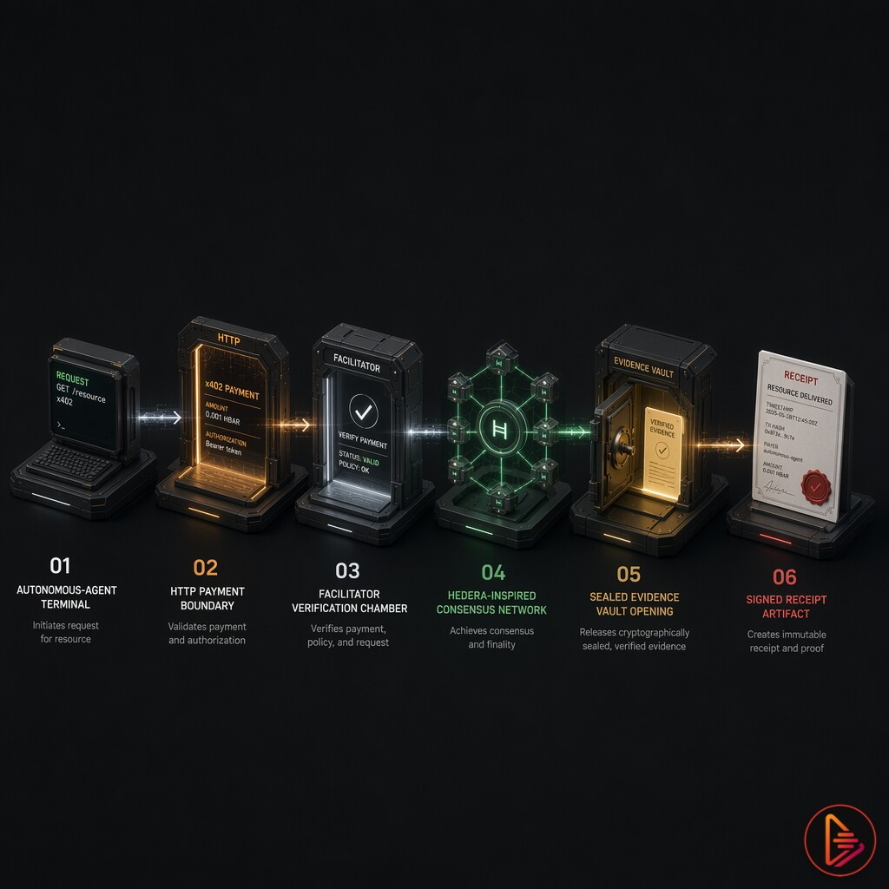
  </a>
</p>

## Why Hedera

ProofPay uses Hedera because its payment model is unusually well suited to
machine-to-machine purchases:

- **Fast deterministic finality** — an agent does not need to wait through
  probabilistic block confirmations.
- **Predictable low fees** — useful for small, discrete evidence purchases.
- **Sponsored network fees** — the buyer authorizes the value transfer while
  the facilitator can pay the transaction fee.
- **Public verification** — HashScan and mirror nodes make settlement evidence
  independently queryable.
- **Clear account roles** — the value buyer, seller, and fee payer can be
  verified separately.

Hedera is an **additive rail**, not a replacement for DeltaSignal’s existing
Base, Circle, Stripe, or MPP integrations. The durable asset is the
payment-to-artifact receipt model, which can work across rails.

## Real testnet proof

This repository does not stop at mock responses. It includes a completed,
publicly verifiable Hedera testnet purchase.

| Field | Performed transaction |
|---|---|
| Network | `hedera:testnet` |
| Asset | HBAR — `0.0.0` |
| Value buyer | `0.0.9676074` |
| Seller | `0.0.9676073` |
| Transaction fee payer | `0.0.7162784` |
| Amount | `1,000,001 tinybar` |
| Result | `SUCCESS` |
| Consensus | `1784665197.689086104` |
| Transaction | [`0.0.7162784-1784665192-906989595`](https://hashscan.io/testnet/transaction/0.0.7162784-1784665192-906989595) |

**Reproduce the evidence checks:**

```bash
npm install
npm run verify -- \
  docs/evidence/proof-bundle-2026-07-21.json \
  docs/evidence/proofpay-receipt-public-key.pem

npm run demo:tamper
```

Expected result:

```text
16 / 16 checks passed
Tampered artifact: REJECTED
```

The public
[`proof bundle`](docs/evidence/proof-bundle-2026-07-21.json) contains the
transaction, quote, receipt, ciphertext, decryption material, and deterministic
evidence required for verification. It contains **no wallet private key** and
**no receipt-signing private key**.

## Try the deployed API

The Azure backend is a public Hedera testnet preview:

```bash
export PROOFPAY="https://proofpay-hedera.kindbeach-299ce8c4.eastus.azurecontainerapps.io"

# No payment
curl "$PROOFPAY/health"
curl "$PROOFPAY/.well-known/proofpay"
curl "$PROOFPAY/catalog"

# Quote creation is also free
curl -X POST "$PROOFPAY/quotes" \
  -H "content-type: application/json" \
  -d '{"ticker":"MSTR","period":"2025-12-31"}'
```

Requesting the returned `paid_resource_url` without a payment produces a real
HTTP `402` challenge containing:

```json
{
  "scheme": "exact",
  "network": "hedera:testnet",
  "asset": "0.0.0",
  "amount": "1000001",
  "payTo": "0.0.9676073",
  "extra": { "feePayer": "0.0.7162784" }
}
```

Creating a quote does not move funds. Signing and submitting a payment requires
explicit buyer authorization.

## Run it locally

Requirements:

- Node.js 20+
- funded Hedera testnet buyer account
- separate testnet seller account
- x402 Hedera facilitator

```bash
npm install
npm run keygen
cp .env.example .env
# Add local testnet values. Never commit .env.
npm run check
npm start
```

In another terminal:

```bash
npm run buy
npm run verify -- artifacts/live-proof/proof-bundle-....json
```

Or run both sides together:

```bash
npm run demo:live
```

### Secret-safe launch options

The buyer’s private key belongs to the **paying agent**, not the ProofPay
backend.

On macOS:

```bash
npm run configure:keychain
npm run demo:keychain
```

With Azure Key Vault:

```bash
az login
AZURE_KEY_VAULT_NAME=aitrailblazerkeyvault npm run demo:keyvault
```

The Key Vault launcher reads:

- `proofpay-hedera-buyer-account-id`
- `proofpay-hedera-buyer-private-key-hex`
- `proofpay-hedera-seller-account-id`
- `proofpay-receipt-private-key-pem-base64`

Values are passed through the child-process environment and are never printed.
The deployed resource server itself stores no buyer private key.

## Why this remains useful after the bounty

ProofPay is not just a one-off payment demo. It gives DeltaSignal reusable
infrastructure for:

1. **Pay-per-query research** — agents purchase one evidence package instead of
   committing to a subscription.
2. **Auditable delivery** — every paid response can carry a portable receipt.
3. **Cross-rail consistency** — Hedera, Base, Circle, and future rails can share
   the same artifact-binding contract.
4. **Agent-native distribution** — no checkout page, API-key exchange, or human
   approval loop is required after wallet policy is configured.
5. **Dispute and reconciliation evidence** — payment and delivery are joined by
   cryptographic hashes rather than correlated only by logs.

<p align="center">
  <a href="img/Scene10.jpg">
    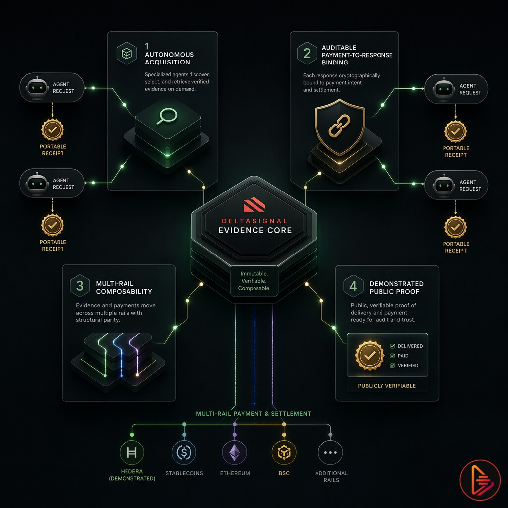
  </a>
</p>

## Demo and submission evidence

| Artifact | Link |
|---|---|
| YouTube-ready 3:43 captioned demo | [Watch / download](https://github.com/aitrailblazer/proofpay-hedera-x402/releases/download/demo-v5/ProofPay_Hedera_x402_Bounty_Demo_YouTube_Edition.mp4) |
| Complete demo release | [`demo-v5`](https://github.com/aitrailblazer/proofpay-hedera-x402/releases/tag/demo-v5) |
| Slide-by-slide transcript | [`ProofPay_Demo_Transcript.txt`](docs/ProofPay_Demo_Transcript.txt) |
| Infographic scene briefs | [`ProofPay_Demo_Infographic_Scene_Briefs.txt`](docs/ProofPay_Demo_Infographic_Scene_Briefs.txt) |
| Visualization prompts | [`ProofPay_Demo_Visualization_Prompts.txt`](docs/ProofPay_Demo_Visualization_Prompts.txt) |
| Submission proof index | [`ProofPay_Submission_Proof_Index.html`](docs/ProofPay_Submission_Proof_Index.html) |
| Recording console | [`ProofPay_Demo_Recording_Console.html`](docs/ProofPay_Demo_Recording_Console.html) |
| Live-proof CI | [GitHub Actions run 29865554201](https://github.com/aitrailblazer/proofpay-hedera-x402/actions/runs/29865554201) |

The enhanced narration is generated locally with phrase-directed Apple Samantha,
deliberate pauses, 48 kHz mastering, corrective EQ, gentle compression, and EBU
R128 normalization. Rebuild it on macOS with:

```bash
PROOFPAY_DEMO_FRAMES=artifacts/demo-frames-v5 npm run demo:frames
PROOFPAY_DEMO_FRAMES=artifacts/demo-frames-v5 \
PROOFPAY_DEMO_OUTPUT=artifacts/demo-video-v6 \
PROOFPAY_DEMO_FILENAME=ProofPay_Hedera_x402_Bounty_Demo_YouTube_Edition.mp4 \
PROOFPAY_CAPTION_MODE=burn \
npm run demo:video
```

`burn` is the publication default: captions remain visibly embedded when
YouTube CC is off. The final MP4 contains only H.264 video and AAC audio, so a
second selectable subtitle stream cannot overlap the burned captions. The
builder also normalizes all scene audio into one continuous AAC timeline from
zero through the final frame, avoiding browser playback gaps at scene changes.

See [`scripts/build-demo-video.ts`](scripts/build-demo-video.ts) and
[`scripts/demo-video-script.json`](scripts/demo-video-script.json).

<details>
<summary><strong>Open the complete 11-scene visual storyboard</strong></summary>

<br>

The images below are explanatory storyboards. Exact transaction values remain
authoritative only in the deterministic overlays, proof bundle, mirror-node
response, and HashScan record. Each publication image contains truthful
provenance metadata and has a receipt in
[`img/provenance/`](img/provenance/manifest.json).

<table>
  <tr>
    <td width="50%" align="center"><a href="img/Scene01.jpg"></a><br><strong>01 · ProofPay opening</strong></td>
    <td width="50%" align="center"><a href="img/Scene02.jpg">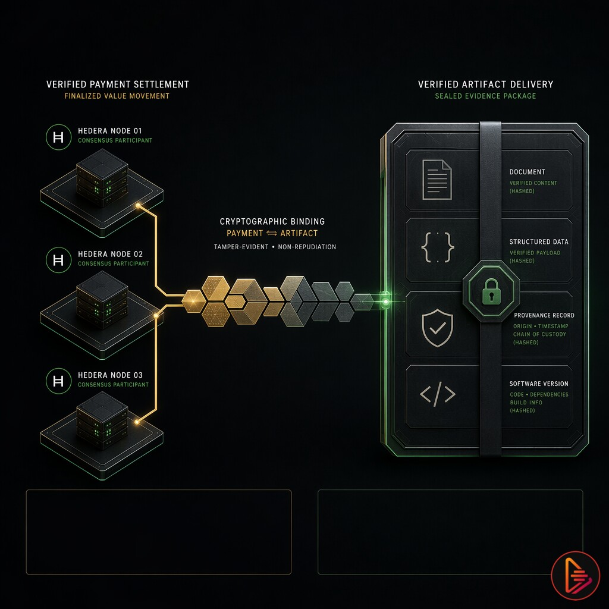</a><br><strong>02 · The missing link</strong></td>
  </tr>
  <tr>
    <td align="center"><a href="img/Scene03.jpg"></a><br><strong>03 · Architecture</strong></td>
    <td align="center"><a href="img/Scene04.jpg">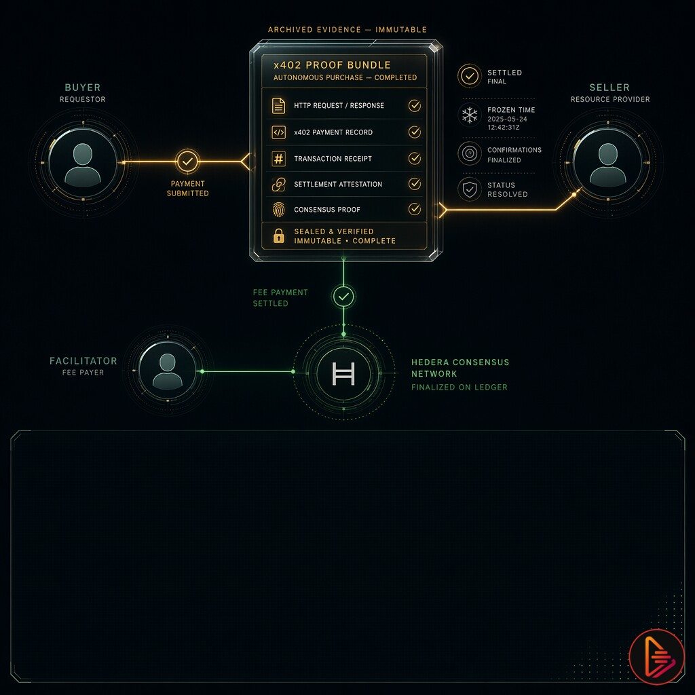</a><br><strong>04 · Completed purchase</strong></td>
  </tr>
  <tr>
    <td align="center"><a href="img/Scene05.jpg">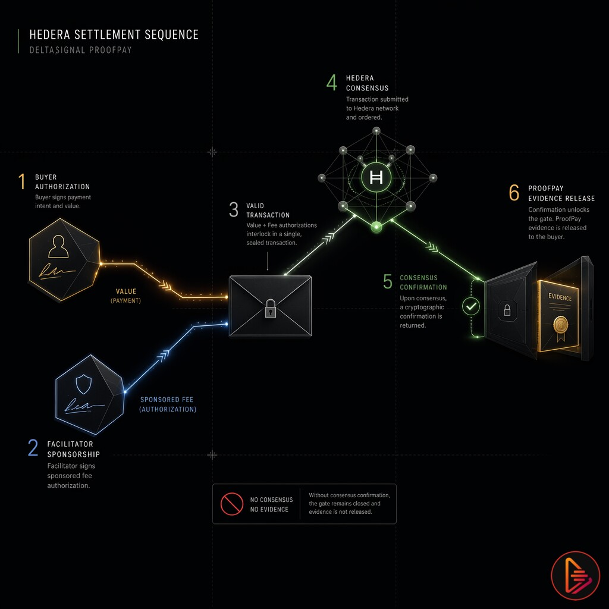</a><br><strong>05 · Sponsored fees</strong></td>
    <td align="center"><a href="img/Scene06.jpg">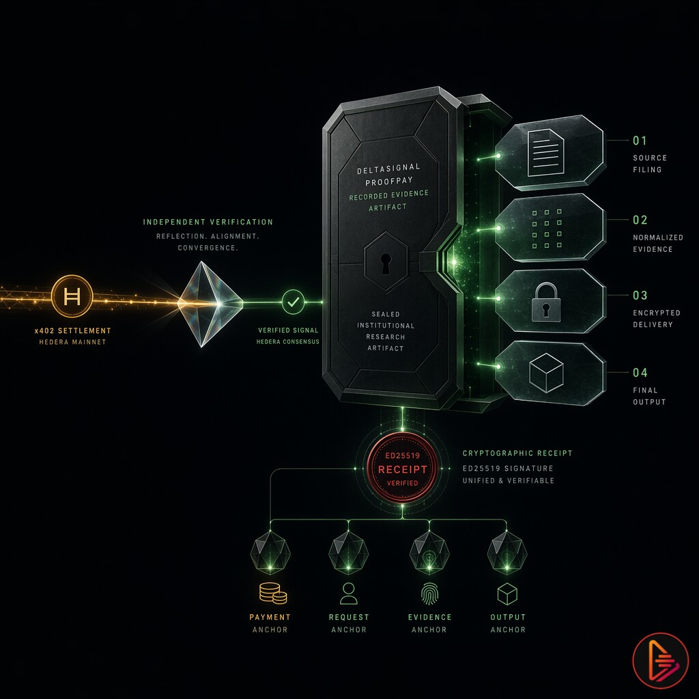</a><br><strong>06 · Evidence unlock</strong></td>
  </tr>
  <tr>
    <td align="center"><a href="img/Scene07.jpg">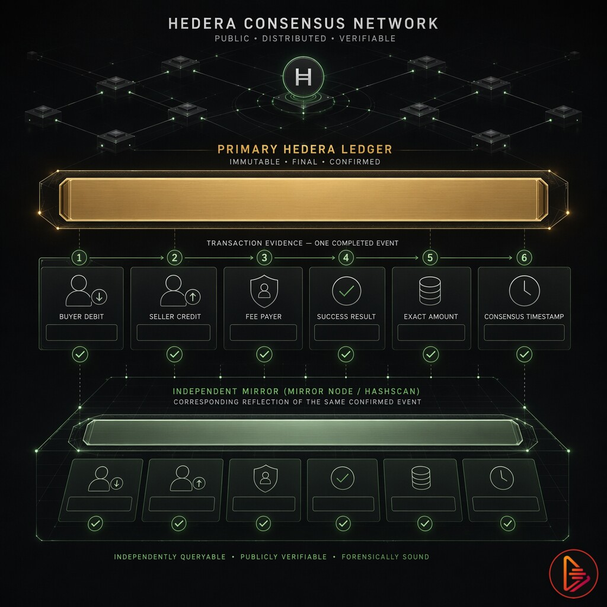</a><br><strong>07 · Ledger proof</strong></td>
    <td align="center"><a href="img/Scene08.jpg">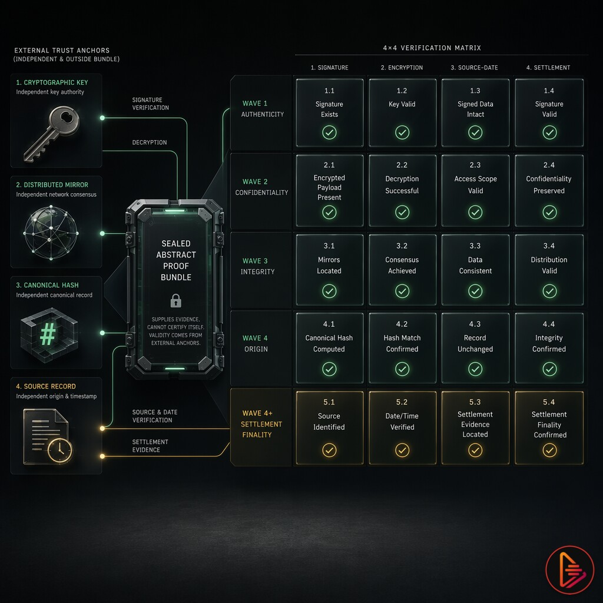</a><br><strong>08 · Independent verification</strong></td>
  </tr>
  <tr>
    <td align="center"><a href="img/Scene09.jpg">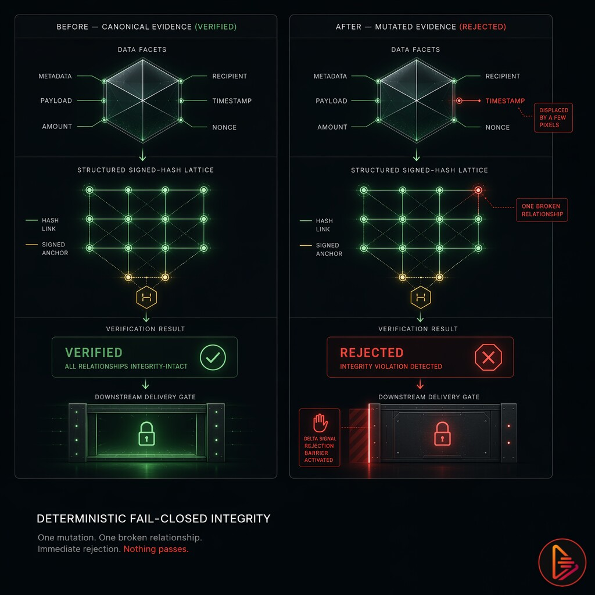</a><br><strong>09 · Tamper detection</strong></td>
    <td align="center"><a href="img/Scene10.jpg"></a><br><strong>10 · DeltaSignal value</strong></td>
  </tr>
  <tr>
    <td align="center"><a href="img/Scene11.jpg">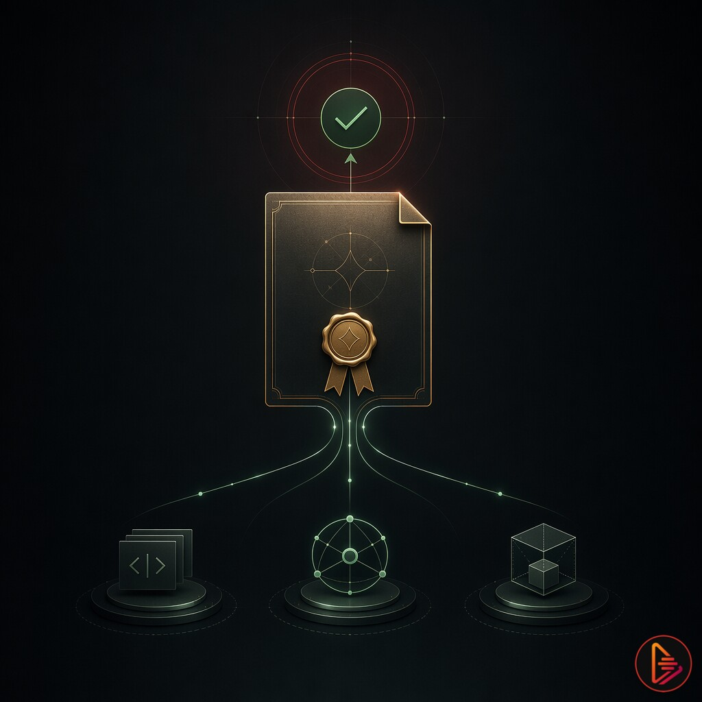</a><br><strong>11 · Public verification</strong></td>
    <td valign="middle"><strong>Every claim is reproducible.</strong><br><br>Source code, settlement, proof bundle, verifier, transcript, prompts, and provenance receipts are public.</td>
  </tr>
</table>

</details>

## Evidence and security boundary

- This is a **public Hedera testnet preview**, not a mainnet payment service.
- The bundled MSTR snapshot is deterministic, public-safe demo evidence captured
  from a filing-backed DeltaSignal response.
- The fixture does not update automatically and is not investment advice.
- No buyer key, seed phrase, facilitator secret, or receipt-signing private key
  is committed.
- Protected output is released only after successful settlement verification.
- Replay protection is persistent and fail-closed.
- Hedera packages currently carry upstream transitive advisories; review
  `npm audit` before production use.

The DeltaSignal logo and visual identity are © 2026 DeltaSignal. All rights
reserved. This notice asserts ownership in the published artifacts; it is not a
representation of government registration.
